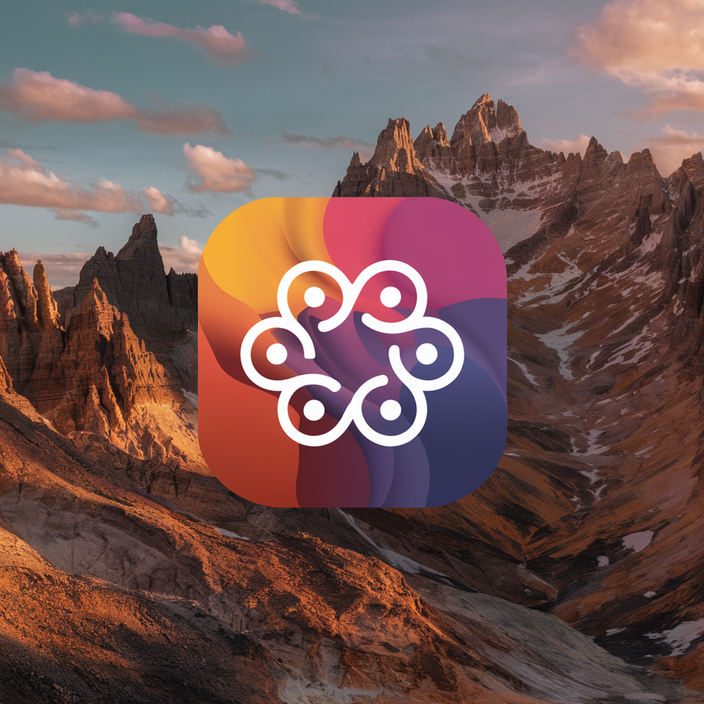

<p align="center">
  
  <!-- Alternative local reference:  -->
</p>

<h1 align="center">Memory Box</h1>

<p align="center">
  A semantic memory storage and retrieval system powered by vector embeddings
</p>

<p align="center">
  <a href="LICENSE"></a>
</p>

Memory Box allows users to save and search for memories using natural language, providing an intuitive way to store and retrieve your important information.

## Features

- **Semantic Search**: Find memories based on meaning, not just keywords
- **Memory Organization**: Organize memories into customizable buckets
- **Vector Embeddings**: Utilizes advanced AI embeddings for accurate memory retrieval
- **Hybrid Search**: Combines vector similarity with keyword boosting for better results
- **Fallback Mechanisms**: Falls back to text search if semantic search yields no results
- **Debug Mode**: Inspect search results with detailed debug information

## Integrations

### Cline MCP Server

[Memory Box MCP Server](https://github.com/amotivv/memory-box-mcp) - An MCP server that allows you to interact with Memory Box directly from Cline!

Features:
- Save memories with proper formatting based on customizable templates
- Search memories using semantic search
- Retrieve memories from specific buckets
- Format memories according to structured guidelines

This integration makes it easy to save important information from your Cline conversations to Memory Box for future retrieval.

## Technology Stack

- **Backend**: FastAPI (Python)
- **Database**: PostgreSQL with pgvector extension
- **Embeddings**: Ollama API with mxbai-embed-large model
- **Containerization**: Docker and Docker Compose

## Prerequisites

- Docker and Docker Compose
- Git

## Installation

1. Clone the repository:
   ```bash
   git clone https://github.com/yourusername/memory-box.git
   cd memory-box
   ```

2. Configure environment variables:
   ```bash
   # For development (default)
   cp env.sample .env
   
   # For production
   cp env.production.sample .env
   
   # Edit the .env file to customize settings
   nano .env
   ```

3. Start the application:
   ```bash
   # For development (default)
   docker-compose up -d
   
   # For production
   APP_ENV=production docker-compose up -d
   ```

4. The API will be available at http://localhost:8000

## Development and Production Environments

Memory Box supports both development and production environments through the `APP_ENV` environment variable.

### Development Environment

The development environment is optimized for local development with features like:
- Hot reloading (code changes apply automatically)
- Human-readable logging format
- Detailed debug information
- Default CORS settings that allow all origins

To run in development mode:
```bash
# Development mode is the default
docker-compose up -d

# Or explicitly specify development mode
APP_ENV=development docker-compose up -d
```

### Production Environment

The production environment is optimized for performance and security:
- Multi-worker configuration for better performance
- JSON-formatted logs compatible with Google Cloud Logging
- Optimized for cloud deployment
- More restrictive CORS settings

To run in production mode:
```bash
# Copy the production environment template
cp env.production.sample .env
# Edit the .env file with your production settings
nano .env
# Start in production mode
APP_ENV=production docker-compose up -d
```

## Usage

### Adding a Memory

```bash
curl -X POST http://localhost:8000/api/v2/memory \
  -H "Content-Type: application/json" \
  -H "Authorization: Bearer your-user-id" \
  -d '{"text": "I learned about vector databases today and how they can be used for semantic search.", "bucketId": "Learning"}'
```

### Searching Memories

```bash
curl "http://localhost:8000/api/v2/memory?query=vector%20databases" \
  -H "Authorization: Bearer your-user-id"
```

### Getting All Memories

```bash
curl "http://localhost:8000/api/v2/memory?all=true" \
  -H "Authorization: Bearer your-user-id"
```

### Getting Memories from a Specific Bucket

```bash
curl "http://localhost:8000/api/v2/memory?bucketId=Learning" \
  -H "Authorization: Bearer your-user-id"
```

## API Documentation

### Endpoints

#### POST /api/v2/memory
Add a new memory.

Request body:
```json
{
  "text": "Your memory text here",
  "bucketId": "Optional bucket name"
}
```

#### GET /api/v2/memory
Retrieve memories with various query parameters:

- `query`: Search for memories semantically similar to this text
- `all`: Set to `true` to retrieve all memories
- `bucketId`: Retrieve memories from a specific bucket
- `debug`: Set to `true` to include debug information in search results

## Development

### Authentication System

Memory Box uses a simple token-based authentication system:

1. The Bearer token in the Authorization header is used directly as the `user_id`
2. There is no built-in user management or password authentication
3. Each client should generate and maintain its own unique token/identifier
4. All memories and buckets are associated with a specific `user_id`
5. Users can only access memories and buckets associated with their `user_id`

Example of using a token in API requests:

```bash
curl -H "Authorization: Bearer your-unique-user-id" http://localhost:8000/api/v2/memory
```

### Database Schema

The application uses two main tables:

1. `memories`: Stores the memory text, vector embeddings, and metadata
   - Each memory is associated with both a `bucket_id` and a `user_id`
   - The `user_id` comes from the Bearer token in the Authorization header

2. `buckets`: Organizes memories into categories
   - Each bucket belongs to a specific `user_id`
   - The combination of `name` and `user_id` must be unique
   - The database enforces that memories can only be associated with buckets that belong to the same user

### Creating a New Bucket

You can use the provided utility script to create a new bucket:

```bash
docker-compose exec memory-api python create_bucket.py "BucketName" "user-id"
```

The `user-id` parameter must match the Bearer token you'll use in API requests to access this bucket.

### Environment Variables

#### Application Environment
- `APP_ENV`: Application environment (`development` or `production`)
- `WORKERS`: Number of worker processes for production mode (default: calculated based on CPU cores)

#### Database Configuration
- `POSTGRES_USER`: PostgreSQL username
- `POSTGRES_PASSWORD`: PostgreSQL password
- `POSTGRES_DB`: PostgreSQL database name
- `POSTGRES_HOST`: PostgreSQL host address

#### Ollama Configuration
- `OLLAMA_URL`: URL of the Ollama API service
- `OLLAMA_MODEL`: Embedding model to use

#### API Configuration
- `API_PORT`: Port for the FastAPI server (default: 8000)
- `CORS_ORIGINS`: Comma-separated list of allowed origins for CORS
- `SIMILARITY_THRESHOLD`: Minimum similarity score for vector search results (default: 0.55)
- `DEFAULT_BUCKET_NAME`: Default bucket name for memories (default: "General")
- `SEARCH_RESULTS_LIMIT`: Maximum number of search results to return (default: 10)
- `INITIAL_SEARCH_LIMIT`: Maximum number of initial results to fetch for reranking (default: 15)
- `KEYWORD_BOOST_FACTOR`: Factor to boost similarity score for keyword matches (default: 0.05)
- `EMBEDDING_TIMEOUT`: Timeout in seconds for embedding API requests (default: 30.0)

## Deployment

### Local Development Deployment

1. Clone the repository:
   ```bash
   git clone https://github.com/yourusername/memory-box.git
   cd memory-box
   ```

2. Use the development environment file:
   ```bash
   cp env.sample .env
   # Edit as needed
   nano .env
   ```

3. Start the application in development mode:
   ```bash
   docker-compose up -d
   ```

4. The API will be available at http://localhost:8000

### Google Cloud VM Deployment

1. Set up a Google Cloud VM with Docker and Docker Compose installed

2. Clone the repository on your VM:
   ```bash
   git clone https://github.com/yourusername/memory-box.git
   cd memory-box
   ```

3. Create a production environment file:
   ```bash
   cp env.production.sample .env
   # Edit with your production settings
   nano .env
   ```

4. Make sure the start.sh script is executable:
   ```bash
   chmod +x backend/start.sh
   ```

5. Start the application in production mode:
   ```bash
   APP_ENV=production docker-compose up -d
   ```

### Connecting to Ollama on the Host Machine

If you're running Ollama directly on your VM (not in Docker), you need to configure the connection between your Docker containers and the host machine:

1. In your `.env` file, set the Ollama URL to use `host.docker.internal`:
   ```
   OLLAMA_URL=http://host.docker.internal:11434
   ```

2. The docker-compose.yml file includes the necessary `extra_hosts` configuration:
   ```yaml
   extra_hosts:
     - "host.docker.internal:host-gateway"
   ```

This setup allows the Docker container to connect to services running on the host machine, such as Ollama listening on port 11434.

#### Troubleshooting Ollama Connection

If you encounter issues connecting to Ollama:

1. Verify Ollama is running on the host:
   ```bash
   curl http://localhost:11434/api/version
   ```

2. Check that Ollama is listening on all interfaces (not just localhost):
   ```bash
   # Check listening interfaces
   sudo netstat -tulpn | grep 11434
   ```

3. If Ollama is only listening on localhost, you may need to configure it to listen on all interfaces or use a reverse proxy.

5. Set up a reverse proxy (recommended for production):
   
   For production deployments, it's recommended to use a reverse proxy in front of the Memory Box API for:
   - SSL/TLS termination
   - Domain name routing
   - Additional security layers
   - Load balancing (if needed)
   
   ### Using Caddy as a Reverse Proxy
   
   [Caddy](https://caddyserver.com/) is a modern, easy-to-configure web server with automatic HTTPS. Here's a simple Caddyfile example:
   
   ```
   yourdomain.com {
     reverse_proxy localhost:8000
     log {
       output file /var/log/caddy/memory-box.log
     }
   }
   ```
   
   This configuration:
   - Automatically obtains and renews SSL certificates
   - Forwards all requests to the Memory Box API
   - Logs access to a dedicated log file
   
   ### Reverse Proxy Considerations
   
   When using a reverse proxy:
   
   - Configure your API to only listen on localhost or internal networks
   - Update CORS settings in your .env file to match your domain
   - Ensure proper headers are forwarded (X-Forwarded-For, X-Real-IP)
   - Consider rate limiting for public-facing APIs
   - Configure appropriate caching policies if needed
   
   ### Firewall Configuration
   
   With a reverse proxy, you only need to expose HTTP (80) and HTTPS (443) ports to the public:
   
   ```bash
   # For Google Cloud VMs
   gcloud compute firewall-rules create web-traffic \
     --allow tcp:80,tcp:443 \
     --target-tags=web-server \
     --description="Allow web traffic"
   ```
   
   Keep the Memory Box API port (8000) restricted to internal traffic only.

## Logging

Memory Box uses a structured logging system that adapts to your environment.

### Development Logging

In development mode, logs are formatted for human readability:
```
2025-02-27 08:00:00 - root - INFO - Application starting up
```

View logs in development with:
```bash
docker-compose logs -f memory-api
```

### Production Logging

In production mode, logs are formatted as JSON for Google Cloud Logging integration:
```json
{"timestamp":"2025-02-27T08:00:00Z","severity":"INFO","message":"Application starting up","logger":"root","function":"startup","line":123}
```

On Google Cloud VM, logs are automatically collected and can be viewed in the Google Cloud Console under Logging.

### Log Levels

The application uses the following log levels:
- `DEBUG`: Detailed information, typically useful only for diagnosing problems
- `INFO`: Confirmation that things are working as expected
- `WARNING`: Indication that something unexpected happened, but the application still works
- `ERROR`: Due to a more serious problem, the application has not been able to perform a function
- `CRITICAL`: A serious error, indicating that the application itself may be unable to continue running

In development mode, all log levels are shown. In production mode, only `INFO` and above are shown by default.

## License

This project is licensed under the GNU Affero General Public License v3.0 (AGPL-3.0) - see the [LICENSE](LICENSE) file for details.

The AGPL-3.0 license ensures that if you modify and use this software to provide a service over a network, you must make your modified source code available to users of that service. This protects the open source nature of the project and prevents proprietary forks.
