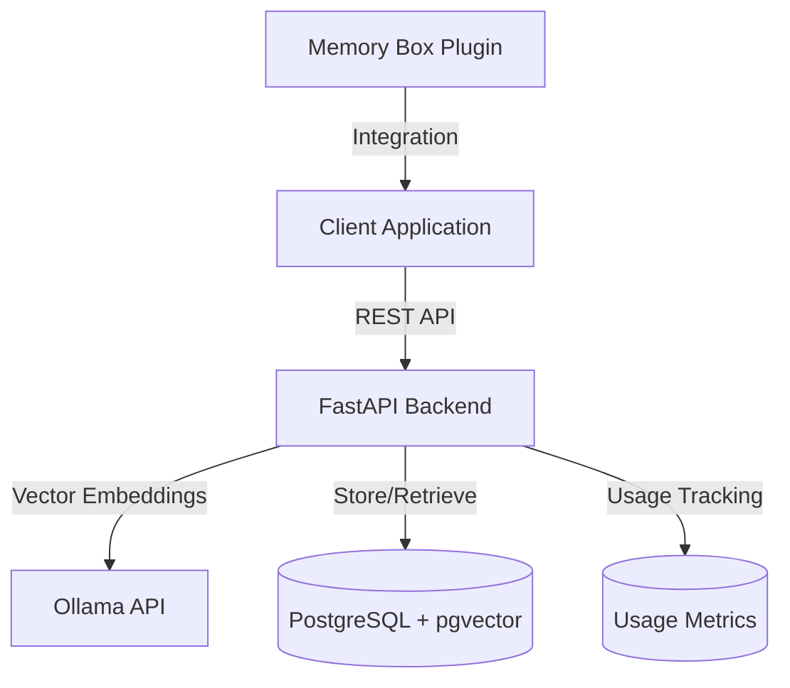
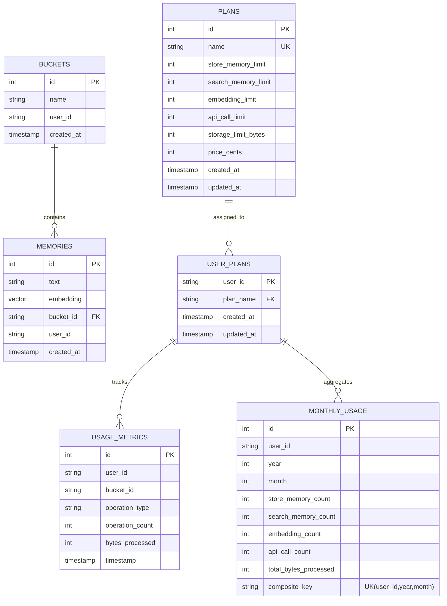

# Memory Box Repository Overview

This repository contains **Memory Box**, a semantic memory storage and retrieval system powered by vector embeddings. It's designed to help users save and search for memories using natural language, providing an intuitive way to store and retrieve important information.

## Architecture

The system consists of:

1. **Backend API** (FastAPI/Python)
   - Handles memory storage and retrieval
   - Processes vector embeddings for semantic search
   - Implements hybrid search with keyword boosting
   - Tracks API usage for billing purposes

2. **Database** (PostgreSQL with pgvector)
   - Stores memories and their vector embeddings
   - Organizes memories into user-specific buckets
   - Enables efficient vector similarity search
   - Records usage metrics and plan information

3. **Embedding Service** (Ollama API)
   - Generates vector embeddings for memories and queries
   - Uses the mxbai-embed-large model

4. **Plugin Integration**
   - Provides a client-side interface for applications
   - Includes caching and error handling

## Key Features

- **Semantic Search**: Find memories based on meaning, not just keywords
- **Memory Organization**: Organize memories into customizable buckets
- **Hybrid Search**: Combines vector similarity with keyword boosting
- **Fallback Mechanisms**: Falls back to text search if semantic search yields no results
- **Debug Mode**: Inspect search results with detailed debug information
- **Usage Tracking**: Records API usage for analytics and billing
- **Plan Management**: Supports different service tiers with configurable limits

## Database Schema

## Authentication System

Memory Box uses a simple token-based authentication system:
- The Bearer token in the Authorization header is used directly as the `user_id`
- No built-in user management or password authentication
- Each client generates and maintains its own unique token/identifier
- All memories and buckets are associated with a specific `user_id`

## Usage Tracking and Billing

Memory Box includes a comprehensive usage tracking system to support various billing models:

1. **Service Tiers**
   - Predefined plans with different resource limits
   - Default plans include: free, basic, professional, and legacy
   - Each plan defines limits for API operations and storage

2. **Usage Metrics**
   - Detailed tracking of API operations by type
   - Measurement of data volume processed
   - Monthly aggregation for billing cycles
   - Operation categorization (store_memory, search_memory, etc.)

3. **Plan Assignment**
   - Each user is assigned to a specific plan
   - Existing users are automatically assigned to the 'legacy' plan
   - Admin API for managing user plans

## Deployment Options

The repository includes configuration for both development and production environments:
- **Development**: Hot reloading, human-readable logs, default CORS settings
- **Production**: Multi-worker configuration, JSON-formatted logs, more restrictive CORS

## Memory Formatting Guidelines

The system includes a structured approach to memory formatting with different templates for various types of information:
- Technical information
- Decisions
- Solutions
- Concepts
- References
- Applications

## API Endpoints

### Memory Management
- `POST /api/v2/memory`: Add a new memory
- `GET /api/v2/memory`: Retrieve memories with various query parameters
  - `query`: Search for memories semantically similar to this text
  - `all`: Set to `true` to retrieve all memories
  - `bucketId`: Retrieve memories from a specific bucket
  - `debug`: Set to `true` to include debug information in search results
- `GET /api/v2/buckets`: List all buckets for a user

### Usage and Plans
- `GET /api/v2/usage`: Retrieve usage statistics for the current user
  - Returns current plan, usage counts, and limits
  - Includes monthly aggregates and operation breakdown

### Admin Endpoints
- `GET /admin/system-stats`: System-wide usage statistics
  - Total operations tracked
  - User distribution by plan
  - Operation breakdown
  - Most active users
- `PUT /admin/user-plans/{user_id}`: Update a user's plan
  - Requires admin token authentication
  - Assigns the specified user to a different plan

### System Endpoints
- `GET /health`: Health check endpoint
- `GET /version`: Version information endpoint

## Environment Configuration

The system can be configured through environment variables:

### Database Configuration
- `POSTGRES_USER`: PostgreSQL username
- `POSTGRES_PASSWORD`: PostgreSQL password
- `POSTGRES_DB`: PostgreSQL database name
- `POSTGRES_HOST`: PostgreSQL host address

### Ollama Configuration
- `OLLAMA_URL`: URL of the Ollama API service
- `OLLAMA_MODEL`: Embedding model to use

### API Configuration
- `API_PORT`: Port for the FastAPI server (default: 8000)
- `CORS_ORIGINS`: Comma-separated list of allowed origins for CORS
- `SIMILARITY_THRESHOLD`: Minimum similarity score for vector search results (default: 0.55)
- `DEFAULT_BUCKET_NAME`: Default bucket name for memories (default: "General")
- `SEARCH_RESULTS_LIMIT`: Maximum number of search results to return (default: 10)
- `INITIAL_SEARCH_LIMIT`: Maximum number of initial results to fetch for reranking (default: 15)
- `KEYWORD_BOOST_FACTOR`: Factor to boost similarity score for keyword matches (default: 0.05)
- `EMBEDDING_TIMEOUT`: Timeout in seconds for embedding API requests (default: 30.0)

### Admin Configuration
- `ADMIN_TOKEN`: Authentication token for admin endpoints

## Technology Stack

- **Backend**: FastAPI (Python)
- **Database**: PostgreSQL with pgvector extension
- **Embeddings**: Ollama API with mxbai-embed-large model
- **Containerization**: Docker and Docker Compose
